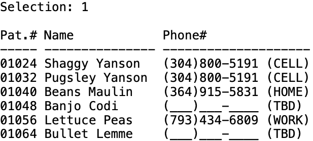

# Summary
The project was originally completed in December 2023 as part of the introduction to C programming course. The console application is designed to efficiently manage data of patients and appointments for a small veterinary operation. 

# Patient Management
When the patient management system is selected initially, a menu with a few options related to patients is displayed and user is prompted to enter a selection:

## View Patient Data

## Search
When searching for patients, user can choose to search by patient number or phone number. Sometimes one phone number is linked to more than one patient, then all matched patients will be displayed.

## Add
As of now the maximum number of patient record can be managed by the system is limited to 20. Attempts to add more patient will be rejected by the system. 

# Appointment Management
Alternatively, user can choose to enter the appointment interface which has following menu options:

## View or View on Date
user can view all future appointments or filter by date, only viewing appointments on a certain future date.

## Conclusions / Outcomes
* learned to effectively use C language to create small console applications;
* learned to break down a large issue into smaller pieces and implement and test each piece gradually;
* inspired by the project that with the knowledge we learned in first semester, we are already able to build useful software
